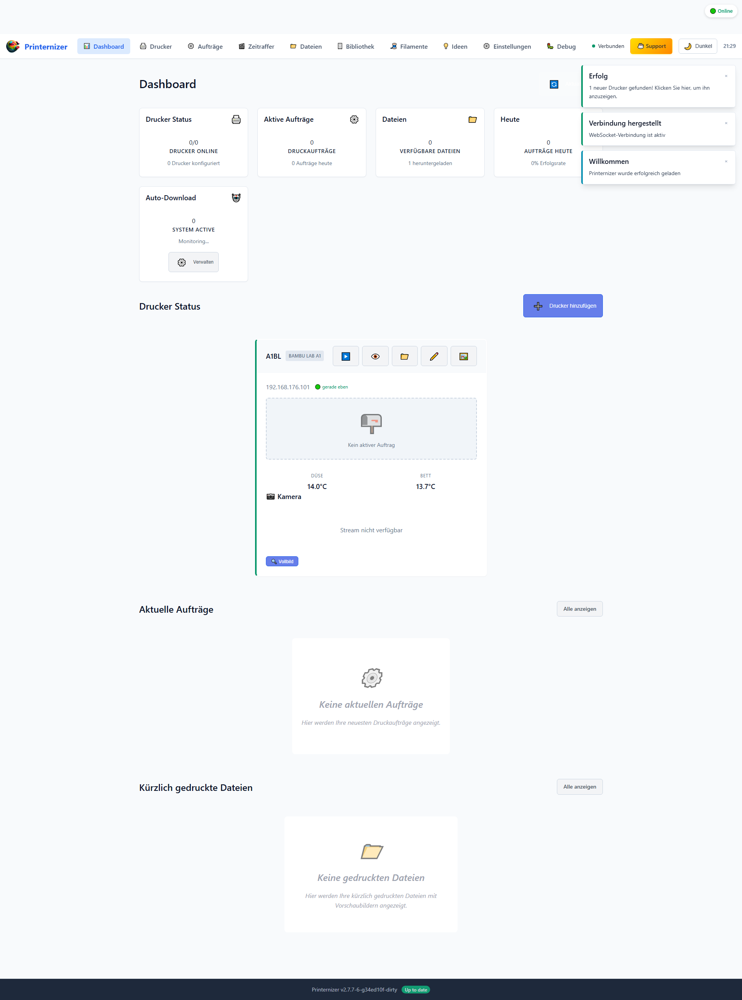
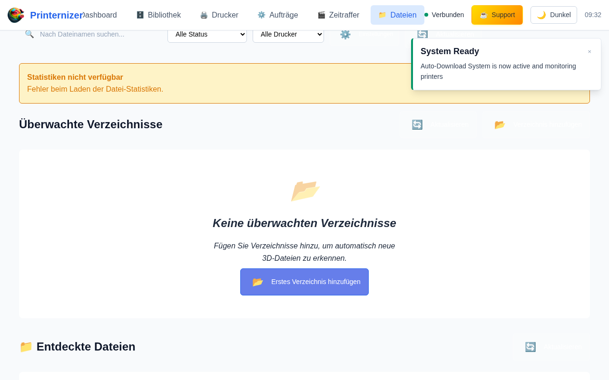
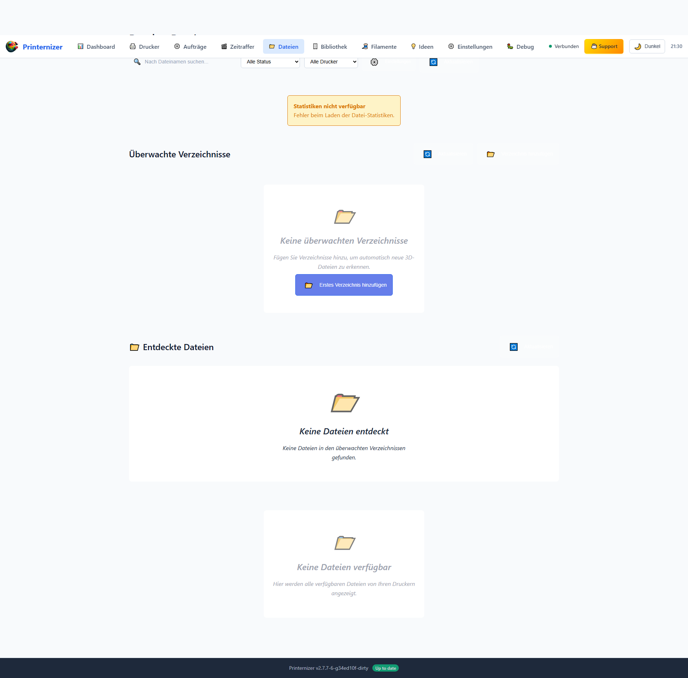
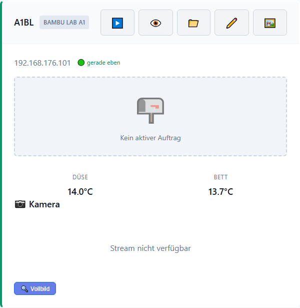
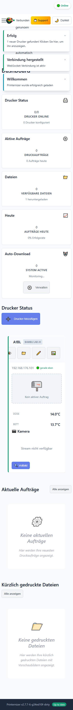

# Printernizer 🖨️

[](https://www.gnu.org/licenses/agpl-3.0)
[](https://github.com/schmacka/printernizer/releases/latest)
[](https://www.python.org/downloads/)
[](https://fastapi.tiangolo.com)
[](https://schmacka.github.io/printernizer/)
[](CONTRIBUTING.md)

**Professional 3D Printer Management System for Bambu Lab & Prusa Core One**

Enterprise-grade fleet management with real-time monitoring, automated job tracking, file management, and business analytics. Perfect for 3D printing services, maker spaces, educational institutions, and production environments.

[📖 Documentation](https://schmacka.github.io/printernizer/) • [🚀 Quick Start](#-quick-start) • [✨ Features](#-features) • [🐳 Deployment](#-deployment-options) • [🤝 Contributing](CONTRIBUTING.md)

---

## 🎯 Overview

Printernizer is a **production-ready** 3D printer management system that transforms how you monitor and manage your 3D printing operations. Built with modern web technologies and designed for both individual makers and enterprise environments.

### Why Printernizer?

- **🔄 Real-Time Monitoring** - Live printer status, temperatures, and job progress via MQTT & HTTP APIs
- **📁 Unified File Management** - Seamless file handling across all printers with one-click downloads
- **🤖 Automated Job Tracking** - Automatically detect and track print jobs across your printer fleet
- **📊 Business Analytics** - Professional dashboards with cost tracking, material consumption, and reporting
- **⚡ Instant Updates** - WebSocket-powered live dashboard with zero page refresh
- **🌐 Multi-Deployment** - Docker, Home Assistant, Raspberry Pi, or standalone Python
- **📱 Mobile Ready** - Fully responsive interface works on any device

### Status: Production Ready (v2.7.0)

✅ **Stable** • ✅ **Tested** • ✅ **Documented** • ✅ **Multi-Platform**

---

## 📸 Screenshots

### Dashboard Overview

Real-time monitoring of your printer fleet with live status updates, temperature monitoring, and job tracking.



### File Management

Unified file browser with smart filtering, status tracking, and one-click downloads from all your printers.



### Jobs & Printer Management

Comprehensive job history and detailed printer status cards with live monitoring.



### Printer Status Cards

Detailed printer information including temperatures, current job progress, and quick actions.



### Mobile Responsive Design

Full functionality on mobile devices with optimized responsive layout.



---

## ✨ Features

### 🖨️ Printer Support

- **Bambu Lab A1** - Full MQTT integration with real-time status updates
- **Prusa Core One** - Complete PrusaLink HTTP API integration
- **Auto-Discovery** - Automatic printer detection via SSDP + mDNS
- **Multi-Printer Fleet** - Monitor unlimited printers simultaneously
- **Connection Health** - Automatic retry, reconnection, and error handling
- **Live Monitoring** - 30-second polling with WebSocket push updates

### 📊 Real-Time Monitoring & Job Management

- **Live Dashboard** - Real-time printer status cards with temperatures and progress
- **Automated Job Creation** - Automatically detect and create job entries when prints start
- **Layer-by-Layer Tracking** - Detailed progress monitoring with time estimates
- **Job History** - Complete print history with success rates and analytics
- **Business Classification** - Distinguish between business orders and personal projects
- **WebSocket Updates** - Instant UI updates without page refresh
- **Mobile Responsive** - Full functionality on phones and tablets

### 📁 Advanced File Management

- **Unified File Browser** - See files from all printers in one centralized view
- **One-Click Downloads** - Direct download from any printer storage
- **Smart Status Tracking** - Visual indicators: 📁 Available, ✓ Downloaded, 💾 Local
- **Drag-and-Drop Upload** - Intuitive file upload to library
- **Intelligent Filtering** - Filter by printer, status, file type, and more
- **3D Preview System** - Automatic thumbnail generation for STL, 3MF, GCODE, BGCODE
- **Metadata Extraction** - Comprehensive metadata parsing from 3D files
- **Storage Analytics** - Track storage usage and optimize disk space

### 🎬 Timelapse Management

- **Automated Monitoring** - Watch folders for timelapse images with auto-detection
- **FlickerFree Integration** - High-quality video processing with deflicker algorithm
- **Gallery UI** - Modern video gallery with thumbnails and fullscreen playback
- **Job Linking** - Automatically link timelapse videos to print jobs
- **Processing Queue** - Sequential processing with real-time status updates
- **Storage Management** - Track video storage and cleanup recommendations

### 📈 Enhanced 3D Model Metadata

- **Physical Properties** - Dimensions, volume, surface area, object count
- **Print Settings** - Layer height, nozzle size, walls, infill, supports, temperatures
- **Material Requirements** - Weight, length, type, colors, waste calculations
- **Cost Breakdown** - Material cost, energy cost, per-gram cost, total estimates
- **Quality Metrics** - Complexity score, difficulty level, success probability
- **Printer Compatibility** - Compatible printer checks, slicer info, profile validation

### 💼 Business & Analytics Features

- **Professional Dashboard** - Clean, business-ready interface with today's statistics
- **Cost Calculations** - Material cost, power consumption, time-based pricing
- **VAT Support** - Built-in VAT calculations (configurable rate, default 19%)
- **Material Tracking** - Monitor material usage and consumption
- **Export Capabilities** - CSV/JSON export for accounting software integration
- **Analytics Reports** - Usage statistics, performance metrics, success rates
- **Multi-Currency** - Configurable currency (EUR default)
- **GDPR Compliance** - Data privacy and retention controls

### 🔐 Security & Compliance

- **Secure Credentials** - Safe printer credential storage
- **Input Validation** - Comprehensive input sanitization
- **CORS Protection** - Domain whitelist configuration
- **GDPR/DSGVO Ready** - Privacy-compliant data handling
- **SSL/TLS Support** - HTTPS enforcement for production
- **Health Monitoring** - Built-in health checks and status endpoints

### 🛠️ Developer Features

- **REST API** - Complete FastAPI-based REST API with OpenAPI/Swagger docs
- **WebSocket API** - Real-time event streaming for custom integrations
- **Database Migrations** - Automatic schema migrations with SQLite
- **Extensible Architecture** - Service-based design for easy customization
- **Comprehensive Testing** - 562+ tests including unit, integration, and E2E tests
- **Prometheus Metrics** - Built-in monitoring and metrics export
- **Health Endpoints** - `/api/v1/health` and `/api/v1/update-check`

---

## 📋 Prerequisites

### System Requirements

- **Python 3.11+** (for development/standalone)
- **Docker & Docker Compose** (recommended for production)
- **Modern Web Browser** with WebSocket support
- **Network Access** to your 3D printers

### Printer Requirements

- **Bambu Lab A1**: IP address, Access Code (8 digits), Serial Number
- **Prusa Core One**: IP address, PrusaLink API Key

---

## 🚀 Quick Start

Choose your preferred deployment method:

### Option 1: Docker (Recommended for Production)

```bash
# Clone the repository
git clone https://github.com/schmacka/printernizer.git
cd printernizer/docker

# Start with Docker Compose
docker-compose up -d

# Access the application
# Web Interface: http://localhost:8000
# API Documentation: http://localhost:8000/docs
```

### Option 2: Home Assistant Add-on

1. In Home Assistant: **Settings → Add-ons → Add-on Store**
2. Click **⋮** menu → **Repositories**
3. Add: `https://github.com/schmacka/printernizer`
4. Find **Printernizer** and click **Install**
5. Configure your printers in the **Configuration** tab
6. Click **Start** and enable **Start on boot**
7. Access via **Open Web UI**

### Option 3: Raspberry Pi Quick Setup

```bash
# Production (master branch)
curl -fsSL https://raw.githubusercontent.com/schmacka/printernizer/master/scripts/pi-deployment/pi-setup.sh | bash

# Testing (development branch)
curl -fsSL https://raw.githubusercontent.com/schmacka/printernizer/development/scripts/pi-deployment/pi-setup.sh | bash
```

### Option 4: Python Standalone (Development)

```bash
# Clone and setup
git clone https://github.com/schmacka/printernizer.git
cd printernizer

# Create virtual environment
python3 -m venv venv
source venv/bin/activate  # On Windows: venv\Scripts\activate

# Install dependencies
pip install -r requirements.txt

# Configure for local development (required - see note below)
cp src/.env.development src/.env

# Run the application
./run.sh  # On Windows: run.bat

# Access the application
# Web Interface: http://localhost:8000
# API Docs: http://localhost:8000/docs
```

> **Note:** The `.env` file is required for local development. The default configuration uses Docker/Home Assistant paths (`/data/printernizer/`) which won't work on a standard Linux system. The `src/.env.development` template provides working local paths.

**Troubleshooting:**
- If you get "permission denied" on `run.sh`, run: `chmod +x run.sh`
- If you get "python: command not found", ensure your virtual environment is activated

For detailed installation instructions, see the [**Installation Guide**](https://schmacka.github.io/printernizer/getting-started/installation/).

---

## 🐳 Deployment Options

| Method | Best For | Setup Time | Documentation |
|--------|----------|------------|---------------|
| **Docker Standalone** | Production servers, NAS | 5 minutes | [Guide](docker/README.md) |
| **Home Assistant** | 24/7 operation, HA users | 10 minutes | [Guide](printernizer/README.md) |
| **Raspberry Pi** | Dedicated device | 10 minutes | [Script](scripts/pi-deployment/) |
| **Python Standalone** | Development, testing | 5 minutes | [Quick Start](#option-4-python-standalone-development) |

**Features by Deployment:**
- ✅ All methods support multi-architecture (x86_64, ARM64, ARMv7)
- ✅ Persistent data storage via volumes/directories
- ✅ Automatic restarts and recovery
- ✅ Environment-based configuration

---

## ⚙️ Configuration

### Environment Variables

Create a `.env` file (or use Home Assistant configuration UI):

```bash
# Application Settings
ENVIRONMENT=production
PORT=8000
LOG_LEVEL=info

# Business Settings
TIMEZONE=Europe/Berlin
CURRENCY=EUR
VAT_RATE=0.19

# Database
DATABASE_PATH=./data/printernizer.db

# Printer Settings
PRINTER_POLLING_INTERVAL=30
MAX_CONCURRENT_DOWNLOADS=5

# WebSocket Support
ENABLE_WEBSOCKETS=true

# Security (Production)
SECURE_SSL_REDIRECT=true
SESSION_COOKIE_SECURE=true
```

### Add Your Printers

Configure printers via the web interface or `config/printers.json`:

```json
{
  "printers": [
    {
      "name": "Bambu Lab A1 #1",
      "type": "bambu_lab",
      "ip_address": "192.168.1.100",
      "access_code": "12345678",
      "serial_number": "AC12345678"
    },
    {
      "name": "Prusa Core One #1",
      "type": "prusa",
      "ip_address": "192.168.1.101",
      "api_key": "your-prusalink-api-key"
    }
  ]
}
```

⚠️ **Security Note**: Never commit `config/printers.json` to version control. Use environment variables or secrets management for production.

For complete configuration reference, see [**Configuration Guide**](https://schmacka.github.io/printernizer/getting-started/configuration/).

---

## 📖 Documentation

Comprehensive documentation is available on **GitHub Pages**:

### 👉 [**https://schmacka.github.io/printernizer/**](https://schmacka.github.io/printernizer/)

**Quick Links:**

- [📘 Getting Started](https://schmacka.github.io/printernizer/getting-started/installation/) - Installation and setup
- [📗 User Guide](https://schmacka.github.io/printernizer/user-guide/) - How to use all features
- [📙 API Reference](https://schmacka.github.io/printernizer/api-reference/) - Complete API documentation
- [📕 Architecture](https://schmacka.github.io/printernizer/architecture/) - System design and technical details
- [📔 Development](https://schmacka.github.io/printernizer/development/contributing/) - Contributing guidelines
- [📓 Deployment](https://schmacka.github.io/printernizer/deployment/) - Production deployment guides
- [📄 Changelog](https://schmacka.github.io/printernizer/changelog/) - Version history

**API Documentation (Interactive):**
- Swagger UI: `http://localhost:8000/docs`
- ReDoc: `http://localhost:8000/redoc`

---

## 🏗️ Architecture

```
┌─────────────────────────────────────────────────────────────┐
│                     Web Browser (Frontend)                   │
│              Modern UI with WebSocket Support                │
└────────────┬────────────────────────────────────────────────┘
             │
             │ HTTP/REST + WebSocket
             ▼
┌─────────────────────────────────────────────────────────────┐
│                   FastAPI Backend (Python)                   │
│  ┌──────────────┐  ┌──────────────┐  ┌──────────────────┐  │
│  │   API Layer  │  │   Services   │  │  WebSocket Hub   │  │
│  │  (Routers)   │  │   (Logic)    │  │  (Real-time)     │  │
│  └──────────────┘  └──────────────┘  └──────────────────┘  │
│                            │                                  │
│                            ▼                                  │
│                  ┌──────────────────┐                        │
│                  │  SQLite Database │                        │
│                  │  (Async Access)  │                        │
│                  └──────────────────┘                        │
└────────────┬────────────────────────────────────────────────┘
             │
             │ MQTT (Bambu) / HTTP (Prusa)
             ▼
┌─────────────────────────────────────────────────────────────┐
│                    3D Printer Fleet                          │
│  ┌────────────────┐              ┌─────────────────┐        │
│  │  Bambu Lab A1  │              │ Prusa Core One  │        │
│  │  (MQTT/FTP)    │              │  (PrusaLink)    │        │
│  └────────────────┘              └─────────────────┘        │
└─────────────────────────────────────────────────────────────┘
```

**Key Components:**
- **FastAPI Backend** - Async Python web framework
- **SQLite Database** - Lightweight, serverless database with migrations
- **WebSocket Hub** - Real-time event broadcasting
- **Service Layer** - Business logic and printer integrations
- **Frontend** - Modern vanilla JavaScript with responsive design

For detailed architecture documentation, see [**Architecture Overview**](https://schmacka.github.io/printernizer/architecture/).

---

## 🛠️ Development

### Development Setup

```bash
# Clone and setup
git clone https://github.com/schmacka/printernizer.git
cd printernizer

# Create virtual environment
python -m venv venv
source venv/bin/activate

# Install dependencies (including dev dependencies)
pip install -r requirements.txt

# Run tests
pytest

# Run with coverage
pytest --cov=src tests/

# Start development server (with auto-reload)
python -m src.main
```

### Project Structure

```
printernizer/
├── src/                    # Application source code (PRIMARY)
│   ├── api/               # FastAPI routers and endpoints
│   ├── services/          # Business logic services
│   ├── models/            # Data models and schemas
│   ├── database/          # Database management
│   ├── printers/          # Printer integrations (Bambu/Prusa)
│   └── utils/             # Utility functions
├── frontend/              # Web interface (PRIMARY)
│   ├── js/                # JavaScript modules
│   ├── css/               # Stylesheets
│   └── index.html         # Main HTML
├── tests/                 # Test suites (562+ tests)
├── docs/                  # Documentation (MkDocs)
├── docker/                # Docker configurations
├── printernizer/          # Home Assistant add-on (auto-synced)
├── scripts/               # Utility scripts
└── migrations/            # Database migrations
```

⚠️ **Important**: Edit code in `/src/` and `/frontend/` only. The `/printernizer/` directory is auto-synced for Home Assistant deployment.

### Contributing

We welcome contributions! Please read our [**Contributing Guide**](CONTRIBUTING.md) for:

- Code of conduct
- Development workflow
- Testing requirements
- Pull request process
- Release procedures

**Quick Contribution Steps:**
1. Fork the repository
2. Create a feature branch: `git checkout -b feature/amazing-feature`
3. Make your changes and add tests
4. Commit: `git commit -m "feat: Add amazing feature"`
5. Push: `git push origin feature/amazing-feature`
6. Open a Pull Request

---

## 🧪 Testing

Printernizer includes comprehensive testing with **562+ tests**:

```bash
# Run all tests
pytest

# Run with coverage report
pytest --cov=src tests/

# Run specific test categories
pytest tests/backend/          # Unit tests
pytest tests/integration/      # Integration tests
pytest tests/e2e/             # End-to-end tests (Playwright)

# Run performance tests
pytest tests/performance/
```

**Test Coverage:**
- ✅ Unit Tests - Core functionality and business logic
- ✅ Integration Tests - Service interactions and database operations
- ✅ E2E Tests - Full user workflows with Playwright
- ✅ Performance Tests - Startup time, query optimization

For testing guidelines, see [**Testing Guide**](https://schmacka.github.io/printernizer/testing/).

---

## 📊 API Endpoints

### Core Endpoints

```bash
# Health & Status
GET  /api/v1/health                        # Health check
GET  /api/v1/update-check                  # Version check

# Printer Management
GET  /api/v1/printers                      # List all printers
POST /api/v1/printers                      # Add printer
GET  /api/v1/printers/{id}                 # Get printer details
GET  /api/v1/printers/{id}/status          # Get live status
POST /api/v1/printers/{id}/monitoring/start # Start monitoring
GET  /api/v1/printers/discover             # Auto-discover printers

# Job Management
GET  /api/v1/jobs                          # List all jobs
POST /api/v1/jobs                          # Create job (manual or auto)
GET  /api/v1/jobs/{id}                     # Get job details
GET  /api/v1/printers/{id}/jobs/current    # Get current job
POST /api/v1/printers/{id}/jobs/sync       # Sync job status

# File Management
GET  /api/v1/files                         # List all files
GET  /api/v1/printers/{id}/files           # List printer files
POST /api/v1/printers/{id}/files/{name}/download  # Download file
GET  /api/v1/files/{id}/metadata           # Get file metadata
POST /api/v1/files/{id}/thumbnail/extract  # Extract thumbnail

# Timelapse Management
GET  /api/v1/timelapses                    # List timelapses
GET  /api/v1/timelapses/{id}               # Get timelapse details
POST /api/v1/timelapses/process            # Trigger processing

# Business Analytics
GET  /api/v1/analytics/summary             # Analytics summary
GET  /api/v1/analytics/export              # Export data (CSV/JSON)

# Real-Time Updates
WebSocket: ws://localhost:8000/ws          # WebSocket connection
```

**Interactive API Documentation:**
- Swagger UI: `http://localhost:8000/docs`
- ReDoc: `http://localhost:8000/redoc`

For complete API documentation, see [**API Reference**](https://schmacka.github.io/printernizer/api-reference/).

---

## 🔧 Troubleshooting

### Common Issues

**Backend won't start:**
```bash
# Check Python version (requires 3.11+)
python --version

# Reinstall dependencies
pip install --force-reinstall -r requirements.txt

# Check database permissions
ls -la data/
```

**Printer connection issues:**
```bash
# Test network connectivity
ping 192.168.1.100

# Verify printer API access
# Bambu Lab: Check Access Code on printer display
# Prusa: Ensure PrusaLink is enabled in printer settings

# Check logs
tail -f logs/printernizer.log
```

**Docker container issues:**
```bash
# Check container logs
docker-compose logs -f

# Restart containers
docker-compose restart

# Rebuild containers
docker-compose down && docker-compose up -d --build
```

**WebSocket connection failures:**
```bash
# Check CORS configuration in .env
CORS_ORIGINS=http://localhost:3000,https://yourdomain.com

# Verify WebSocket is enabled
ENABLE_WEBSOCKETS=true

# Check firewall rules (allow port 8000)
```

For more troubleshooting tips, see [**Troubleshooting Guide**](https://schmacka.github.io/printernizer/user-guide/troubleshooting/).

---

## 🗺️ Roadmap

### Current Version: 2.7.0 (Production Ready) ✅

**Completed Features:**
- ✅ Complete backend with FastAPI + async SQLite
- ✅ Full printer integration (Bambu Lab A1 + Prusa Core One)
- ✅ Real-time monitoring with WebSocket updates
- ✅ Advanced file management and download system
- ✅ Automated job creation and tracking
- ✅ Timelapse management system
- ✅ Enhanced 3D model metadata extraction
- ✅ Business analytics and reporting
- ✅ Docker containerization (standalone & Home Assistant)
- ✅ Multi-architecture support (x86_64, ARM64, ARMv7)
- ✅ Comprehensive documentation (GitHub Pages)
- ✅ 562+ tests with CI/CD pipeline

### Coming Soon

- 🔄 **Advanced Home Assistant Integration** - MQTT discovery, sensors, automations
- 🔄 **Watch Folders** - Automatic file monitoring and processing
- 🔄 **Kubernetes Orchestration** - Production-grade orchestration
- 🔄 **Multi-User Authentication** - Role-based access control
- 🔄 **Advanced Analytics** - Predictive maintenance, failure analysis
- 🔄 **Additional Printer Support** - More printer models and brands

### Future Vision

- 📱 Mobile app (iOS/Android)
- 🎮 Klipper firmware integration
- 🤖 AI-powered print optimization
- 🌐 Cloud synchronization options
- 📊 Advanced business reporting

Have a feature request? [Open an issue](https://github.com/schmacka/printernizer/issues) or join the discussion!

---

## 📄 License

Printernizer is **dual-licensed** to balance open source collaboration with sustainable development:

### Open Source License

**AGPL-3.0** for open source projects, personal use, and contributions.

- ✅ Free to use, modify, and distribute under AGPL terms
- ✅ Perfect for developers, researchers, and open source projects
- ✅ Community contributions welcome

### Commercial License

Required for commercial SaaS, enterprise deployments, and proprietary modifications.

- 🏢 Removes AGPL obligations
- 🏢 Commercial use rights
- 🏢 Technical support and priority updates
- 📧 Contact: sebastian@porcus3d.de

See the [LICENSE](LICENSE) file for complete terms and [SECURITY.md](SECURITY.md) for security policies.

---

## 🙏 Acknowledgments

Printernizer is built with excellent open source technologies:

- [**FastAPI**](https://fastapi.tiangolo.com/) - Modern, fast web framework
- [**SQLite**](https://sqlite.org/) - Lightweight, embedded database
- [**paho-mqtt**](https://www.eclipse.org/paho/) - MQTT client library
- [**Trimesh**](https://trimesh.org/) - 3D geometry processing
- [**Material for MkDocs**](https://squidfunk.github.io/mkdocs-material/) - Documentation theme
- [**Playwright**](https://playwright.dev/) - End-to-end testing

Special thanks to:
- Bambu Lab for their API documentation
- Prusa Research for PrusaLink
- All our contributors and users

---

## 💬 Support & Community

### Getting Help

- 📖 **Documentation**: [GitHub Pages](https://schmacka.github.io/printernizer/)
- 🐛 **Bug Reports**: [GitHub Issues](https://github.com/schmacka/printernizer/issues)
- 💬 **Discussions**: [GitHub Discussions](https://github.com/schmacka/printernizer/discussions)
- 📧 **Security Issues**: See [SECURITY.md](SECURITY.md)

### Support Development

If Printernizer helps you manage your 3D printers, consider supporting its development:

[](https://buymeacoffee.com/porcus3d)

**[☕ Buy Me a Coffee](https://buymeacoffee.com/porcus3d)**

Your support helps us:
- 🚀 Develop new features and improvements
- 🐛 Fix bugs and maintain code quality
- 📚 Create better documentation
- 🌍 Expand printer compatibility

---

## ⭐ Star History

If you find Printernizer useful, please consider giving it a ⭐ on GitHub!

[](https://star-history.com/#schmacka/printernizer&Date)

---

<div align="center">

**Printernizer** - Professional 3D Printer Management Made Simple

[Website](https://schmacka.github.io/printernizer/) • [Documentation](https://schmacka.github.io/printernizer/) • [GitHub](https://github.com/schmacka/printernizer) • [Releases](https://github.com/schmacka/printernizer/releases)

Made with ❤️ by the Printernizer community

</div>
