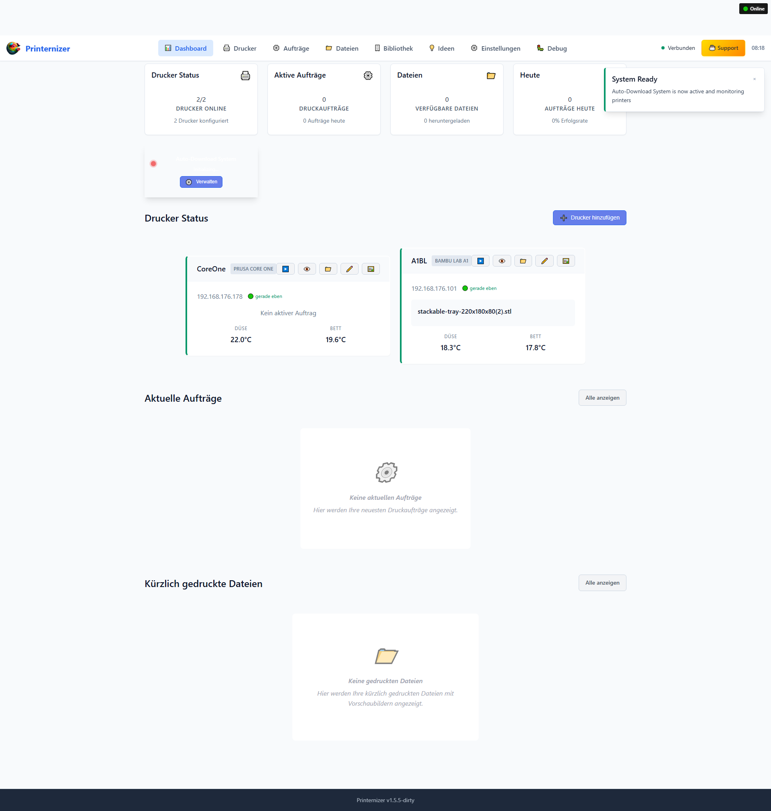
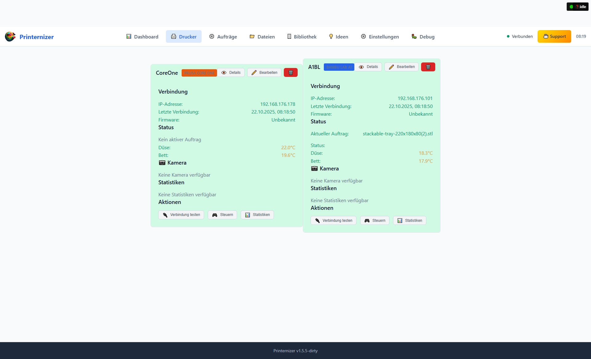
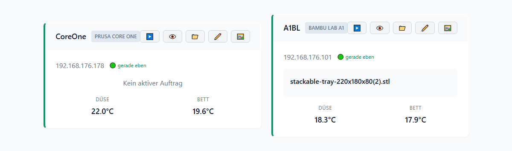

# Printernizer 🖨️

[](https://www.gnu.org/licenses/agpl-3.0)
[](https://www.python.org/downloads/)
[](https://fastapi.tiangolo.com)
[](https://github.com/psf/black)
[](http://makeapullrequest.com)

**Professional 3D Printer Management System for Bambu Lab A1 and Prusa Core One**

Enterprise-grade fleet management with real-time monitoring, automated file handling, and business analytics. Perfect for 3D printing services, educational institutions, and production environments.

## 📋 Table of Contents

- [Overview](#-overview)
- [Features](#-features)
- [Quick Start](#-quick-start)
- [Prerequisites](#-prerequisites)
- [Configuration](#-configuration)
- [Architecture](#-architecture)
- [User Interface](#-user-interface)
- [Development](#-development)
- [Deployment](#-deployment)
- [Contributing](#-contributing)
- [License](#-license)
- [Commercial Licensing](#commercial-license)
- [Support](#-support)

## 🎯 Overview



Printernizer is a **complete production-ready** 3D printer management system that provides:

- 🔄 **Real-time printer monitoring** - Live status, temperature, and job progress via MQTT & HTTP APIs
- 📁 **Unified file management** - Seamless file handling with one-click downloads and status tracking
- 🏢 **Business-ready interface** - Professional dashboard with compliance features and analytics
- ⚡ **WebSocket real-time updates** - Live dashboard with instant status updates
- 🚀 **Enterprise deployment** - Docker, Kubernetes, monitoring, and CI/CD ready
- 🔧 **Easy setup** - Multiple deployment options with comprehensive documentation

## ✨ Features

### 🖨️ Printer Support
- **Bambu Lab A1** - Full MQTT integration with real-time status updates
- **Prusa Core One** - HTTP API integration via PrusaLink
- **Auto-discovery** - Automatically find printers on your network (SSDP + mDNS)
- **Multi-printer management** - Simultaneous monitoring of multiple printers
- **Connection health monitoring** - Automatic retry and error handling

### 📊 Real-time Monitoring
- **Live status updates** - Current printer state, temperatures, progress
- **Job tracking** - Layer-by-layer progress with time estimates
- **WebSocket connectivity** - Instant updates without page refresh
- **Mobile responsive** - Full functionality on phones and tablets

### 📁 File Management
- **Unified file browser** - See files from all printers in one place
- **One-click downloads** - Direct download from printer storage
- **Status tracking** - Visual indicators for file availability and download status
- **Smart filtering** - Filter by printer, status, and file type
- **3D preview thumbnails** - Automatic thumbnail generation for STL, 3MF, GCODE, and BGCODE files
- **Intelligent caching** - 30-day cache for fast preview loading

### 🏢 Business Features
- **Professional dashboard** - Clean, business-ready interface
- **Analytics and reporting** - Usage statistics and performance metrics
- **Multi-user support** - Role-based access control
- **GDPR compliance** - Data privacy and retention controls

### 🚀 Deployment Options

**Choose the deployment method that fits your needs:**

1. **Python Standalone** - Direct Python installation
   - Best for: Development, testing, local installation
   - Setup time: 5 minutes
   - [Quick Start](#option-1-python-development-setup)

2. **Docker Standalone** - Containerized deployment
   - Best for: Production servers, NAS systems
   - Setup time: 5 minutes
   - [Docker Guide](docker/README.md)

3. **Home Assistant Add-on** - Integrated with Home Assistant
   - Best for: Home Assistant users, 24/7 operation
   - Setup time: 10 minutes
   - [Add-on Guide](printernizer/README.md)

## ✅ Current Status: **PRODUCTION READY v2.0.0**

**Core functionality implemented and tested:**
- ✅ Complete backend with FastAPI + async SQLite
- ✅ Professional web interface with mobile-responsive design
- ✅ Full printer integration (Bambu Lab A1 + Prusa Core One)
- ✅ Real-time monitoring with WebSocket updates
- ✅ File management and download system
- ✅ 3D preview system (STL, 3MF, GCODE, BGCODE rendering)
- ✅ System optimization (error handling, monitoring, health checks)
- ✅ Business analytics and reporting features
- ✅ **Docker containerization** (standalone & Home Assistant)
- ✅ **Multi-architecture support** (x86_64, ARM64, ARMv7)

**Coming Soon:**
- 🔄 Kubernetes orchestration (planned)
- 🔄 Advanced HA integration (MQTT discovery, sensors, automations)
- 🔄 Watch folders and automation (planned)

## 🚀 Quick Start

Choose your preferred deployment method below.

### Option 1: Python Standalone (Development)

```bash
# 1. Create virtual environment (optional but recommended)
python -m venv venv
# Windows:
venv\Scripts\activate
# Linux/Mac:
source venv/bin/activate

# 2. Install core dependencies
pip install fastapi uvicorn aiosqlite aiohttp websockets pydantic paho-mqtt python-dotenv aiofiles structlog trimesh numpy-stl matplotlib scipy

# 3. Create environment file (already exists)
# Edit .env with your printer configurations if needed

# 4. Start the backend
# Windows:
run.bat
# Linux/Mac:
./run.sh
# Or manually:
cd src
python main.py

# 5. Start the frontend (optional - open new terminal)
cd frontend
python -m http.server 3000

# 6. Access the application
# Backend API: http://localhost:8000
# Frontend: http://localhost:3000 (if started separately)
# API Docs: http://localhost:8000/docs
```

### Option 2: Docker Standalone (Production)

Run Printernizer in a Docker container for production deployments:

```bash
# From project root
cd docker
docker-compose up -d

# Access the application
# Web Interface: http://localhost:8000
# API Documentation: http://localhost:8000/docs

# View logs
docker-compose logs -f

# Stop
docker-compose down
```

**Features:**
- Persistent data storage via Docker volumes
- Automatic restarts
- Resource isolation
- Easy backup and migration
- Production-ready configuration

For detailed instructions, see [docker/README.md](docker/README.md)

### Option 3: Home Assistant Add-on (24/7 Integration)

Install as a Home Assistant Add-on for seamless integration:

**Via Repository:**
1. In Home Assistant: **Settings → Add-ons → Add-on Store**
2. Click **⋮** menu → **Repositories**
3. Add: `https://github.com/schmacka/printernizer`
4. Find **Printernizer** in store and click **Install**
5. Configure your printers in the **Configuration** tab
6. Click **Start** and enable **Start on boot**
7. Access via **Open Web UI**

**Features:**
- Integrated with Home Assistant UI
- Automatic updates
- Configuration via HA interface
- Persistent storage in `/data`
- Multi-architecture support (RPi, x86_64, etc.)
- Ingress support for secure access

For detailed instructions, see [printernizer/README.md](printernizer/README.md)

## 📋 Prerequisites

### System Requirements
- **Python 3.11+** (for development)
- **Docker & Docker Compose** (recommended)
- **Modern web browser** with WebSocket support
- **Network access** to your 3D printers

### 3D Printer Requirements
- **Bambu Lab A1**: IP address, Access Code (8 digits), Serial Number
- **Prusa Core One**: IP address, PrusaLink API Key

## ⚙️ Configuration

### Environment Variables (.env)

```bash
# Application Settings
ENVIRONMENT=development
PORT=8000
LOG_LEVEL=info

# German Business Settings  
TIMEZONE=Europe/Berlin
CURRENCY=EUR
VAT_RATE=0.19
BUSINESS_LOCATION=Kornwestheim, Deutschland

# Database
DATABASE_PATH=./data/printernizer.db

# CORS (add your domain)
CORS_ORIGINS=http://localhost:3000,https://yourdomain.com

# Printer Settings
PRINTER_POLLING_INTERVAL=30
MAX_CONCURRENT_DOWNLOADS=5

# WebSocket Support
ENABLE_WEBSOCKETS=true

# Security (Production)
SECURE_SSL_REDIRECT=false  # Set to true in production
SESSION_COOKIE_SECURE=false  # Set to true in production
```

### Printer Configuration

Add your printers via the web interface or JSON configuration:

```json
{
  "printers": [
    {
      "name": "Bambu Lab A1 #1",
      "type": "bambu_lab",
      "ip_address": "192.168.1.100",
      "access_code": "12345678",
      "serial_number": "AC12345678"
    },
    {
      "name": "Prusa Core One #1", 
      "type": "prusa",
      "ip_address": "192.168.1.101",
      "api_key": "your-prusalink-api-key"
    }
  ]
}
```

## 🏗️ Architecture

```
┌─────────────────┐    ┌─────────────────┐    ┌─────────────────┐
│   Web Browser   │◄──►│   FastAPI       │◄──►│   SQLite DB     │
│   (Frontend)    │    │   Backend       │    │   (Data)        │
└─────────────────┘    └─────────────────┘    └─────────────────┘
         │                       │                       │
         │              ┌─────────────────┐              │
         │              │   WebSocket     │              │
         └─────────────►│   Real-time     │◄─────────────┘
                        │   Updates       │
                        └─────────────────┘
                                 │
                    ┌─────────────────────────────────┐
                    │          Printers               │
                    │  ┌─────────────┐ ┌────────────┐ │
                    │  │ Bambu Lab   │ │ Prusa Core │ │
                    │  │ A1 (MQTT)   │ │ One (HTTP) │ │
                    │  └─────────────┘ └────────────┘ │
                    └─────────────────────────────────┘
```

## 🖥️ User Interface

### Dashboard


- **Real-time printer status cards** with temperatures and job progress
- **Connection monitoring** with signal strength indicators
- **German business overview** with today's statistics

### Drucker-Dateien (File Management)


- **Unified file listing** from all connected printers
- **One-click downloads** with progress bars
- **Status tracking**: 📁 Available, ✓ Downloaded, 💾 Local
- **Smart filtering** by printer, status, and file type

### Job Management


- **Real-time job tracking** with layer-by-layer progress
- **German business calculations** (material cost + VAT)
- **Job history** with success rates and analytics

### Printer Configuration


- **Add/edit printers** with connection testing
- **Monitor connection quality** and response times
- **Start/stop monitoring** for each printer individually

## 📱 Features

### ✅ Real-time Monitoring
- Live temperature monitoring (bed + nozzle)
- Job progress with estimated completion times
- Connection status with automatic recovery
- WebSocket updates every 30 seconds

### ✅ German Business Compliance
- Complete German language interface
- 19% VAT calculations with EUR currency
- GDPR-compliant data handling
- Europe/Berlin timezone for all timestamps
- German business reporting formats

### ✅ File Management System
- Automatic file discovery on connected printers
- Download progress tracking with speeds
- Local file organization by printer/date
- Bulk download operations
- Storage cleanup and optimization

### ✅ Enterprise Features
- Multi-printer fleet management
- Business vs. private job classification
- Cost tracking (materials + power + labor)
- Export capabilities for German accounting software
- Advanced analytics and reporting

## 📊 API Endpoints

### Core Endpoints
```bash
# Health Check
GET /api/v1/health

# Printer Management
GET /api/v1/printers
POST /api/v1/printers
GET /api/v1/printers/{id}
GET /api/v1/printers/{id}/status
POST /api/v1/printers/{id}/monitoring/start

# File Management (Drucker-Dateien)
GET /api/v1/printers/{id}/files
POST /api/v1/printers/{id}/files/{filename}/download
GET /api/v1/files

# Job Management
GET /api/v1/jobs
GET /api/v1/printers/{id}/jobs/current
POST /api/v1/printers/{id}/jobs/sync

# Business Analytics
GET /api/v1/analytics/summary
GET /api/v1/analytics/export

# Real-time Updates
WebSocket: ws://localhost:8000/ws
```

## 🐳 Docker Services

### Development
```bash
# Start all services
docker-compose up -d

# View logs
docker-compose logs -f printernizer-backend

# Stop services
docker-compose down
```

### Production Stack
- **printernizer-backend**: FastAPI application server
- **printernizer-frontend**: Nginx serving static files  
- **printernizer-redis**: Session storage and caching
- **prometheus**: Metrics collection
- **grafana**: Monitoring dashboards

## 🔧 Troubleshooting

### Common Issues

**Backend won't start:**
```bash
# Check Python version (requires 3.11+)
python --version

# Install dependencies
pip install -r requirements.txt

# Check database permissions
ls -la data/
```

**Frontend can't connect to backend:**
```bash
# Verify backend is running
curl http://localhost:8000/api/v1/health

# Check CORS configuration in .env
# Add your frontend URL to CORS_ORIGINS
```

**Printer connection issues:**
```bash
# Test printer connectivity
ping 192.168.1.100

# Check printer API access
# Bambu Lab: Verify Access Code on printer display
# Prusa: Verify PrusaLink is enabled and API key is correct
```

### Logs and Debugging

```bash
# Backend logs
tail -f logs/printernizer.log

# Docker logs
docker-compose logs -f printernizer-backend

# Database inspection
sqlite3 data/printernizer.db ".tables"
```

## 📈 Monitoring

### Health Checks
- **Backend**: `GET /api/v1/health`
- **Database**: Connection test on startup
- **Printers**: Real-time connectivity monitoring

### Metrics (Prometheus)
- Printer response times
- WebSocket connection counts  
- File download statistics
- German business calculations

### Dashboards (Grafana)
- Real-time printer monitoring
- Business analytics dashboard
- System performance metrics

## 🌍 German Market Features

### Language Localization
- Complete German interface ("Drucker", "Aufträge", "Dateien")
- German date/time formatting (DD.MM.YYYY HH:mm)
- German error messages and notifications
- Professional business terminology

### Business Compliance
- **19% VAT calculations** with German precision
- **GDPR/DSGVO compliance** with 7-year data retention
- **EUR currency formatting** (1.234,56 €)
- **Kornwestheim, Germany** as business location
- **Export compatibility** with German accounting software (DATEV)

## 🔐 Security

### Production Security Features
- HTTPS/SSL enforcement
- Security headers (HSTS, CSP, X-Frame-Options)
- CORS protection with domain whitelist
- Input validation and sanitization
- Sealed secrets for printer credentials

### GDPR Compliance
- Data protection by design
- User consent management
- Right to erasure implementation
- Data retention policies
- Privacy-compliant logging

## 🚀 Deployment Options

### 1. Local Development
```bash
# Windows: run.bat
# Linux/Mac: ./run.sh
# Access: http://localhost:8000
```

### 2. Docker Development
```bash
docker-compose up -d
# Access: http://localhost:3000
```

### 3. Production Server
```bash
docker-compose -f docker-compose.yml up -d
# With SSL termination and domain configuration
```

### 4. Kubernetes Production
```bash
kubectl apply -f production.yml
# Full enterprise deployment with auto-scaling
```

## 📝 Support & Documentation

### Additional Documentation
- **User Guide**: [`docs/USER_GUIDE.md`](docs/USER_GUIDE.md) - Complete user documentation
- **API Documentation**: http://localhost:8000/docs (Swagger UI)
- **Development Plan**: [`docs/development/development-plan.md`](docs/development/development-plan.md) - Complete project roadmap
- **Preview Rendering**: [`docs/PREVIEW_RENDERING.md`](docs/PREVIEW_RENDERING.md) - 3D preview system documentation
- **Server Improvements**: [`docs/SERVER_IMPROVEMENTS.md`](docs/SERVER_IMPROVEMENTS.md) - Optimization and monitoring

### Getting Help
1. Check the troubleshooting section above
2. Review the logs for error messages
3. Verify printer network connectivity
4. Test API endpoints manually

## 🛠️ Development

### Project Structure
```
printernizer/
├── src/                    # Application source code
│   ├── api/               # FastAPI routers and endpoints
│   ├── services/          # Business logic services
│   ├── models/            # Data models and schemas
│   ├── database/          # Database management
│   └── utils/             # Utility functions
├── frontend/              # Web interface files
├── tests/                 # Test suites
├── docs/                  # Documentation
├── scripts/               # Utility scripts
└── config/                # Configuration files
```

### Running Tests
```bash
# Run all tests
python -m pytest

# Run with coverage
python -m pytest --cov=src tests/

# Run specific test category
python -m pytest tests/backend/
```

### Code Quality
```bash
# Format code
black src/ tests/

# Lint code
pylint src/

# Type checking
mypy src/
```

## 🚀 Deployment

### Current Deployment Options

**Python Application (Recommended)**
```bash
# Production deployment with systemd or similar
sudo systemctl enable printernizer
sudo systemctl start printernizer
```

**Development Server**
```bash
# Simple development deployment
nohup python src/main.py &
```

### Planned Deployment Options

**Docker Deployment (Coming Soon)**
- Single container deployment
- Multi-service orchestration with databases
- Production-ready containerization

**Kubernetes Deployment (Coming Soon)**
- Scalable production deployment
- High availability configuration
- Advanced monitoring and alerting

### Production Considerations
- Configure SSL/TLS for HTTPS
- Set up proper logging and monitoring
- Configure backup strategies for SQLite database
- Use reverse proxy (nginx/Apache) for production

## 🤝 Contributing

We welcome contributions! Please see our [Contributing Guidelines](CONTRIBUTING.md) for details.

### Quick Start for Contributors
1. Fork the repository
2. Create a feature branch
3. Make your changes
4. Add tests for new functionality
5. Submit a pull request

### Reporting Issues
- Use GitHub Issues for bug reports and feature requests
- Provide detailed information about your environment
- Include steps to reproduce for bugs

## 📄 License

Printernizer is dual-licensed to balance open source collaboration with sustainable development:

### Open Source License
- **AGPL-3.0** for open source projects, personal use, and contributions
- Free to use, modify, and distribute under AGPL terms
- Perfect for developers, researchers, and open source projects

### Commercial License
- Required for commercial SaaS, enterprise deployments, and proprietary modifications
- Removes AGPL obligations and provides commercial use rights
- Includes technical support and priority updates
- Contact: sebastian@porcus3d.de

See the [LICENSE](LICENSE) file for complete terms and commercial licensing details.

## 🆘 Support

- 📖 **Documentation**: Check the [docs/](docs/) directory
- 🐛 **Bug Reports**: [GitHub Issues](https://github.com/schmacka/printernizer/issues)
- 💬 **Discussions**: [GitHub Discussions](https://github.com/schmacka/printernizer/discussions)
- 📧 **Security Issues**: See [SECURITY.md](SECURITY.md)

### ☕ Support Development

If Printernizer helps you manage your 3D printers and you'd like to support its continued development:

[](https://buymeacoffee.com/porcus3d)

**[Support us on Buy Me a Coffee](https://buymeacoffee.com/porcus3d)**

Your support helps us:
- 🚀 Develop new features and improvements
- 🐛 Fix bugs and maintain code quality
- 📚 Create better documentation and tutorials
- 🌍 Expand printer compatibility and integrations

Every contribution, no matter how small, is greatly appreciated and helps make Printernizer better for everyone!

## 🙏 Acknowledgments

- Built with [FastAPI](https://fastapi.tiangolo.com/) and [SQLite](https://sqlite.org/)
- Bambu Lab integration via [bambulabs-api](https://github.com/matthewbaggett/bambulabs-api)
- Prusa integration via PrusaLink HTTP API
- Frontend uses modern web standards and WebSocket connectivity

---

**Printernizer** - Professional 3D Printer Management System
*Making 3D printing fleet management simple and efficient*