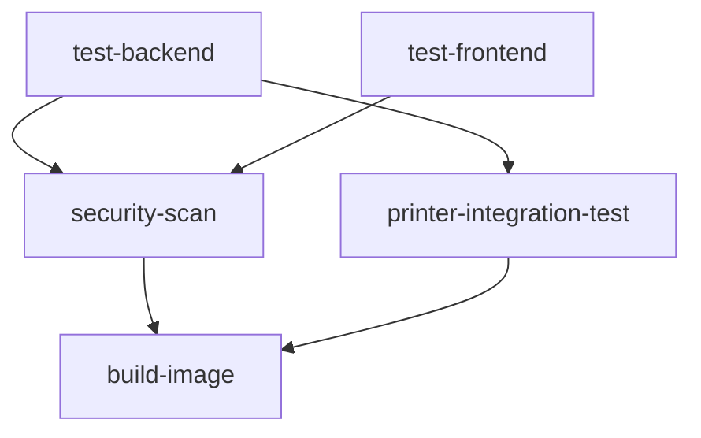

# CI/CD Test Coverage Documentation

This document describes the comprehensive test coverage in the Printernizer CI/CD pipeline.

## Overview

**Total Tests:** 419 tests across Python and JavaScript

The CI/CD workflow (`/.github/workflows/ci-cd.yml`) runs all available tests organized into three main jobs:

1. **Backend Tests** - Python tests with coverage reporting
2. **Frontend Tests** - JavaScript tests with Jest
3. **Printer Integration Tests** - Redundant printer-specific validation (non-PR builds only)

## Backend Test Job (`test-backend`)

**Runs:** 397 Python tests with code coverage

**Test Directories:**
```bash
python -m pytest tests/backend/ tests/services/ tests/integration/ \
  tests/test_essential_config.py \
  tests/test_essential_integration.py \
  tests/test_essential_models.py \
  tests/test_infrastructure.py \
  tests/test_printer_interface_conformance.py \
  tests/test_sync_consistency.py
```

### Test Categories

#### tests/backend/ (259 tests)
Core backend functionality tests:
- **test_api_files.py** (24 tests) - File management API endpoints
- **test_api_health.py** (9 tests) - Health check endpoints
- **test_api_jobs.py** (29 tests) - Job management API
- **test_api_printers.py** (26 tests) - Printer management API
- **test_auto_job_performance.py** (13 tests) - Auto-job creation performance
- **test_database.py** (18 tests) - Database operations
- **test_end_to_end.py** (9 tests) - End-to-end workflows
- **test_error_handling.py** (28 tests) - Error handling and edge cases
- **test_german_business.py** (21 tests) - German VAT, currency, compliance
- **test_integration.py** (16 tests) - Cross-component integration
- **test_job_null_fix.py** (5 tests) - Job null value handling
- **test_library_service.py** (29 tests) - Library/file storage
- **test_performance.py** (11 tests) - Performance benchmarks
- **test_websocket.py** (21 tests) - WebSocket communication

#### tests/services/ (63 tests)
Service layer business logic:
- **test_auto_job_creation.py** (28 tests) - Automatic job creation logic
- **test_file_download_service.py** (17 tests) - File download functionality
- **test_printer_connection_service.py** (18 tests) - Printer connection management

#### tests/integration/ (14 tests)
Cross-component integration workflows:
- **test_auto_job_integration.py** (14 tests) - Auto-job integration scenarios

#### Root-Level Essential Tests (48 tests)
Core system validation:
- **test_essential_config.py** (15 tests) - Configuration management
- **test_essential_integration.py** (17 tests) - Essential integration workflows
- **test_essential_models.py** (16 tests) - Data model validation

#### Root-Level Infrastructure Tests (13 tests)
System infrastructure validation:
- **test_infrastructure.py** (5 tests) - Infrastructure setup
- **test_printer_interface_conformance.py** (3 tests) - Printer interface compliance
- **test_sync_consistency.py** (5 tests) - Code sync validation

### Test Configuration

**Coverage Requirements:**
- Minimum threshold: 85% code coverage
- Reports: XML (for Codecov), HTML (artifacts), terminal
- Coverage path: `src/` (excludes tests, migrations, main entry point)

**Test Markers:**
- `@pytest.mark.unit` - Unit tests (40 tests)
- `@pytest.mark.asyncio` - Async tests (155 tests)
- `@pytest.mark.skip` - Skipped tests (27 tests)
- Note: No tests use `@pytest.mark.integration` marker

**Environment:**
```yaml
ENVIRONMENT: testing
DATABASE_PATH: test.db
DATABASE_URL: sqlite:///test.db
REDIS_URL: redis://localhost:6379
MOCK_PRINTERS: "true"
LOG_LEVEL: INFO
```

**Timeouts:**
- Test timeout: 300 seconds
- Max failures: 20 (fail-fast threshold)

**Quality Gates:**
- Pass rate threshold: 45% minimum (baseline)
- Coverage uploaded to Codecov
- JUnit XML results for CI integration

## Frontend Test Job (`test-frontend`)

**Runs:** JavaScript tests in `tests/frontend/` with Jest

**Test Files:**
- api.test.js - API client tests
- dashboard.test.js - Dashboard component tests
- websocket.test.js - WebSocket client tests
- test_essential_forms.js - Form validation tests
- test_essential_printer_monitoring.js - Printer monitoring UI tests

**Configuration:**
- Framework: Jest with jsdom environment
- Coverage: Enabled with HTML/JSON/text reports
- Pass rate threshold: 95% minimum (high bar for frontend)

**Environment:**
```bash
npm run test:coverage -- --ci --reporters=default --reporters=jest-junit
```

## Printer Integration Test Job (`printer-integration-test`)

**Status:** Redundant validation job (kept for backwards compatibility)

**Runs:** Only on non-PR builds (after backend tests complete)

**Tests:**
```bash
python -m pytest tests/test_essential_printer_drivers.py \
  tests/test_essential_printer_api.py \
  tests/backend/test_api_printers.py
```

**Note:** These tests are already included in the main backend test job. This job provides additional validation on non-PR builds (pushes to main/develop branches).

## Security Scanning Job (`security-scan`)

Runs after backend and frontend tests complete:
- **Trivy** - Filesystem vulnerability scanner
- **Bandit** - Python security linter
- SARIF results uploaded to GitHub Security tab (if enabled)

## Test Execution Flow



**Parallel Execution:**
- `test-backend` and `test-frontend` run in parallel
- `security-scan` waits for both to complete
- `printer-integration-test` runs only on non-PR builds after backend
- `build-image` waits for all tests to complete

## Running Tests Locally

### All Backend Tests (matches CI)
```bash
python -m pytest tests/backend/ tests/services/ tests/integration/ \
  tests/test_essential_config.py \
  tests/test_essential_integration.py \
  tests/test_essential_models.py \
  tests/test_infrastructure.py \
  tests/test_printer_interface_conformance.py \
  tests/test_sync_consistency.py \
  --cov=src --cov-report=html --cov-report=term-missing -v
```

### Quick Backend Tests (no coverage)
```bash
pytest tests/backend/ -v
```

### Frontend Tests
```bash
cd tests/frontend
npm install
npm test
```

### Specific Test Categories
```bash
# Services only
pytest tests/services/ -v

# Integration only
pytest tests/integration/ -v

# Essential tests only
pytest tests/test_essential_*.py -v

# German business logic
pytest tests/backend/test_german_business.py -v

# Performance tests
pytest tests/backend/test_performance.py -v
```

## Test Maintenance

### Adding New Tests

1. **Backend Tests:** Add to appropriate directory under `tests/backend/`
2. **Service Tests:** Add to `tests/services/`
3. **Integration Tests:** Add to `tests/integration/`
4. **Essential Tests:** Add to root `tests/test_essential_*.py`

New tests are **automatically** picked up by CI/CD - no workflow changes needed!

### Test Markers

To add test categorization:

```python
@pytest.mark.unit
def test_something():
    pass

@pytest.mark.asyncio
async def test_async_operation():
    pass
```

**Available markers** (see `pytest.ini`):
- unit, integration, e2e, performance
- german, vat, currency, timezone
- database, websocket, network
- bambu, prusa
- slow, security

### Coverage Goals

- **Overall:** 85% minimum
- **Critical modules:** 90%+ (printer service, job service, analytics)
- **German business logic:** 100% (VAT, currency, compliance)

## Troubleshooting

### Test Failures in CI but Passes Locally

**Common causes:**
1. Missing environment variables (check `env:` section in workflow)
2. Database state differences (CI uses fresh SQLite database)
3. Timezone issues (ensure Europe/Berlin timezone)
4. File path differences (use absolute paths with `/tmp/`)

### Low Pass Rate

**If pass rate drops below 45%:**
1. CI build fails immediately
2. Review failed tests in artifacts
3. Fix critical failures first
4. Update pass rate threshold if needed (currently 45% baseline)

### Missing Coverage

**If coverage drops below 85%:**
1. CI build fails
2. Check HTML coverage report in artifacts
3. Add tests for uncovered lines
4. Update `pytest.ini` if exclusions needed

## Recent Changes

**2024-11-12:** Added comprehensive test coverage
- Added `tests/services/` (63 tests)
- Added `tests/integration/` (14 tests)
- Added root-level essential and infrastructure tests (61 tests)
- Removed ineffective `-m "not integration"` filter
- Total coverage: 397 Python tests (up from 259)

## References

- CI/CD Workflow: `.github/workflows/ci-cd.yml`
- Test Configuration: `pytest.ini`
- Test Dependencies: `requirements-test.txt`
- Frontend Tests: `tests/frontend/package.json`
- Test Fixtures: `tests/conftest.py`
