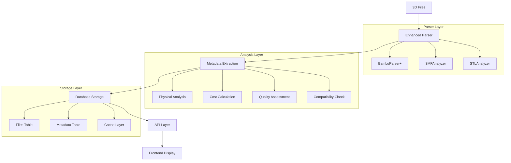

# Enhanced 3D Model Metadata - Technical Design

**Related Feature:** [METADATA-001] Enhanced 3D Model Metadata Display  
**Version:** 1.0  
**Last Updated:** October 1, 2025

## Architecture Overview



## Implementation Details

### 1. Parser Enhancements

#### Extended BambuParser
```python
# src/services/bambu_parser.py

class EnhancedBambuParser(BambuParser):
    """Enhanced parser with comprehensive metadata extraction."""
    
    # Extended metadata patterns for G-code parsing
    ADVANCED_METADATA_PATTERNS = {
        # Physical properties
        'model_width': re.compile(r'; model_width = ([\d.]+)', re.IGNORECASE),
        'model_depth': re.compile(r'; model_depth = ([\d.]+)', re.IGNORECASE),
        'model_height': re.compile(r'; model_height = ([\d.]+)', re.IGNORECASE),
        'model_volume': re.compile(r'; model_volume = ([\d.]+)', re.IGNORECASE),
        
        # Print settings
        'nozzle_diameter': re.compile(r'; nozzle_diameter = ([\d.]+)', re.IGNORECASE),
        'wall_loops': re.compile(r'; wall_loops = (\d+)', re.IGNORECASE),
        'top_shell_layers': re.compile(r'; top_shell_layers = (\d+)', re.IGNORECASE),
        'bottom_shell_layers': re.compile(r'; bottom_shell_layers = (\d+)', re.IGNORECASE),
        'infill_pattern': re.compile(r'; sparse_infill_pattern = (.+)', re.IGNORECASE),
        
        # Advanced settings
        'overhang_speed': re.compile(r'; overhang_speed = ([\d.]+)', re.IGNORECASE),
        'bridge_speed': re.compile(r'; bridge_speed = ([\d.]+)', re.IGNORECASE),
        'support_angle': re.compile(r'; support_threshold_angle = (\d+)', re.IGNORECASE),
        
        # Compatibility
        'compatible_printers': re.compile(r'; compatible_printers = (.+)', re.IGNORECASE),
        'bed_type': re.compile(r'; curr_bed_type = (.+)', re.IGNORECASE),
        'slicer_version': re.compile(r'; (.+Studio) ([\d.]+)', re.IGNORECASE),
        
        # Cost and material
        'filament_density': re.compile(r'; filament_density = ([\d.,]+)', re.IGNORECASE),
        'filament_diameter': re.compile(r'; filament_diameter = ([\d.,]+)', re.IGNORECASE),
        'total_weight': re.compile(r'; total filament weight \[g\] = ([\d.]+)', re.IGNORECASE),
        'total_length': re.compile(r'; total filament length \[mm\] = ([\d.,]+)', re.IGNORECASE),
    }
    
    def extract_comprehensive_metadata(self, content: str) -> Dict[str, Any]:
        """Extract all available metadata from G-code content."""
        metadata = self._extract_gcode_metadata(content)  # Base implementation
        
        # Extract advanced metadata
        for key, pattern in self.ADVANCED_METADATA_PATTERNS.items():
            match = pattern.search(content)
            if match:
                value = match.group(1).strip()
                metadata[key] = self._convert_value(key, value)
        
        # Calculate derived values
        metadata.update(self._calculate_derived_metrics(metadata))
        
        return metadata
    
    def _convert_value(self, key: str, value: str) -> Any:
        """Convert string values to appropriate types."""
        if key in ['model_width', 'model_depth', 'model_height', 'model_volume', 
                   'nozzle_diameter', 'overhang_speed', 'bridge_speed']:
            return float(value)
        elif key in ['wall_loops', 'top_shell_layers', 'bottom_shell_layers', 'support_angle']:
            return int(value)
        elif key in ['filament_density', 'filament_diameter', 'total_length']:
            # Handle comma-separated values for multi-material
            return [float(x.strip()) for x in value.split(',')]
        elif key == 'compatible_printers':
            # Parse printer list
            return [p.strip().strip('"') for p in value.split(',')]
        else:
            return value
    
    def _calculate_derived_metrics(self, metadata: Dict[str, Any]) -> Dict[str, Any]:
        """Calculate derived metrics from extracted data."""
        derived = {}
        
        # Calculate wall thickness
        if 'wall_loops' in metadata and 'nozzle_diameter' in metadata:
            derived['wall_thickness'] = metadata['wall_loops'] * metadata['nozzle_diameter']
        
        # Calculate total filament weight and length
        if 'filament_density' in metadata and 'total_length' in metadata:
            densities = metadata['filament_density']
            lengths = metadata['total_length']
            if isinstance(densities, list) and isinstance(lengths, list):
                # Multi-material calculation
                weights = []
                for i, (density, length) in enumerate(zip(densities, lengths)):
                    # Volume = π * r² * length (assuming 1.75mm diameter)
                    radius = 1.75 / 2  # mm
                    volume = 3.14159 * (radius ** 2) * length  # mm³
                    weight = (volume / 1000) * density  # convert to cm³ then to grams
                    weights.append(weight)
                derived['total_filament_weight'] = sum(weights)
                derived['filament_weights'] = weights
        
        # Calculate complexity score
        derived['complexity_score'] = self._calculate_complexity_score(metadata)
        
        return derived
    
    def _calculate_complexity_score(self, metadata: Dict[str, Any]) -> int:
        """Calculate print complexity score (1-10)."""
        score = 5  # Base score
        
        # Layer height factor
        if 'layer_height' in metadata:
            if metadata['layer_height'] <= 0.1:
                score += 2  # Very fine layers
            elif metadata['layer_height'] <= 0.15:
                score += 1  # Fine layers
            elif metadata['layer_height'] >= 0.3:
                score -= 1  # Coarse layers
        
        # Support factor
        if metadata.get('support_used', False):
            score += 1
        
        # Infill complexity
        if 'infill_pattern' in metadata:
            complex_patterns = ['gyroid', 'voronoi', 'lightning']
            if any(pattern in metadata['infill_pattern'].lower() for pattern in complex_patterns):
                score += 1
        
        # Multi-material complexity
        if isinstance(metadata.get('filament_type'), list):
            score += len(metadata['filament_type']) - 1
        
        return max(1, min(10, score))
```

#### New 3MF Analyzer
```python
# src/services/threemf_analyzer.py

import json
import zipfile
from typing import Dict, Any, List, Tuple
from pathlib import Path

class ThreeMFAnalyzer:
    """Comprehensive analyzer for 3MF files."""
    
    def __init__(self):
        self.supported_extensions = ['.3mf']
    
    async def analyze_file(self, file_path: Path) -> Dict[str, Any]:
        """Analyze 3MF file and extract comprehensive metadata."""
        metadata = {
            'physical_properties': {},
            'print_settings': {},
            'material_info': {},
            'compatibility': {},
            'cost_analysis': {},
            'quality_metrics': {}
        }
        
        try:
            with zipfile.ZipFile(file_path, 'r') as zip_file:
                # Analyze different components
                metadata['physical_properties'] = await self._analyze_model_geometry(zip_file)
                metadata['print_settings'] = await self._analyze_print_settings(zip_file)
                metadata['material_info'] = await self._analyze_material_usage(zip_file)
                metadata['compatibility'] = await self._analyze_compatibility(zip_file)
                metadata['cost_analysis'] = await self._calculate_costs(metadata)
                metadata['quality_metrics'] = await self._assess_quality(metadata)
                
        except Exception as e:
            logger.error("Failed to analyze 3MF file", file_path=str(file_path), error=str(e))
            
        return metadata
    
    async def _analyze_model_geometry(self, zip_file: zipfile.ZipFile) -> Dict[str, Any]:
        """Extract physical properties from 3MF model files."""
        geometry = {}
        
        try:
            # Parse plate JSON for object layout
            with zip_file.open('Metadata/plate_1.json') as f:
                plate_data = json.loads(f.read().decode('utf-8'))
                
            # Extract bounding box information
            if 'bbox_all' in plate_data:
                bbox = plate_data['bbox_all']
                geometry['dimensions'] = {
                    'width': bbox[2] - bbox[0],
                    'depth': bbox[3] - bbox[1],
                    'height': 0  # Will be calculated from layer info
                }
                geometry['bounding_box'] = {
                    'min_x': bbox[0], 'min_y': bbox[1],
                    'max_x': bbox[2], 'max_y': bbox[3]
                }
            
            # Extract object count and details
            if 'bbox_objects' in plate_data:
                objects = plate_data['bbox_objects']
                geometry['object_count'] = len([obj for obj in objects if obj.get('name') != 'wipe_tower'])
                geometry['objects'] = []
                
                total_area = 0
                for obj in objects:
                    if obj.get('name') != 'wipe_tower':
                        obj_info = {
                            'name': obj.get('name', 'Unknown'),
                            'area': obj.get('area', 0),
                            'layer_height': obj.get('layer_height', 0.2)
                        }
                        geometry['objects'].append(obj_info)
                        total_area += obj.get('area', 0)
                
                geometry['total_print_area'] = total_area
            
        except Exception as e:
            logger.warning("Could not extract geometry data", error=str(e))
            
        return geometry
    
    async def _analyze_print_settings(self, zip_file: zipfile.ZipFile) -> Dict[str, Any]:
        """Extract print settings from configuration files."""
        settings = {}
        
        try:
            # Parse process settings
            with zip_file.open('Metadata/process_settings_1.config') as f:
                config_data = json.loads(f.read().decode('utf-8'))
                
            # Extract key print parameters
            settings.update({
                'layer_height': config_data.get('layer_height', [0.2])[0],
                'first_layer_height': config_data.get('first_layer_height', [0.2])[0],
                'wall_loops': config_data.get('wall_loops', [2])[0],
                'top_shell_layers': config_data.get('top_shell_layers', 3),
                'bottom_shell_layers': config_data.get('bottom_shell_layers', 3),
                'infill_density': float(config_data.get('sparse_infill_density', ['20%'])[0].rstrip('%')),
                'infill_pattern': config_data.get('sparse_infill_pattern', 'gyroid'),
                'support_used': config_data.get('enable_support', False),
                'nozzle_diameter': config_data.get('nozzle_diameter', [0.4])[0],
            })
            
            # Extract temperature settings
            settings.update({
                'nozzle_temperature': config_data.get('nozzle_temperature', [210])[0],
                'bed_temperature': config_data.get('bed_temperature', [60])[0],
                'chamber_temperature': config_data.get('chamber_temperature', [0])[0],
            })
            
            # Extract speed settings
            settings.update({
                'print_speed': config_data.get('outer_wall_speed', [50])[0],
                'infill_speed': config_data.get('sparse_infill_speed', [100])[0],
                'travel_speed': config_data.get('travel_speed', [150])[0],
            })
            
        except Exception as e:
            logger.warning("Could not extract print settings", error=str(e))
            
        return settings
    
    async def _analyze_material_usage(self, zip_file: zipfile.ZipFile) -> Dict[str, Any]:
        """Extract material and filament information."""
        material_info = {}
        
        try:
            # Parse slice info for material data
            with zip_file.open('Metadata/slice_info.config') as f:
                slice_content = f.read().decode('utf-8')
                
            # Extract weight and prediction from XML
            import xml.etree.ElementTree as ET
            root = ET.fromstring(slice_content)
            
            plate = root.find('plate')
            if plate is not None:
                material_info['estimated_weight'] = float(plate.find("metadata[@key='weight']").get('value', 0))
                material_info['estimated_time'] = int(plate.find("metadata[@key='prediction']").get('value', 0))
                material_info['support_used'] = plate.find("metadata[@key='support_used']").get('value', 'false') == 'true'
                
                # Extract filament mapping
                filament_maps = plate.find("metadata[@key='filament_maps']")
                if filament_maps is not None:
                    maps = filament_maps.get('value', '').split()
                    material_info['filament_slots'] = [int(slot) for slot in maps if slot.isdigit()]
            
            # Parse plate JSON for color information
            with zip_file.open('Metadata/plate_1.json') as f:
                plate_data = json.loads(f.read().decode('utf-8'))
                
            material_info['filament_colors'] = plate_data.get('filament_colors', [])
            material_info['filament_ids'] = plate_data.get('filament_ids', [])
            
        except Exception as e:
            logger.warning("Could not extract material usage", error=str(e))
            
        return material_info
    
    async def _calculate_costs(self, metadata: Dict[str, Any]) -> Dict[str, Any]:
        """Calculate comprehensive cost breakdown."""
        costs = {
            'material_cost': 0.0,
            'energy_cost': 0.0,
            'total_cost': 0.0,
            'cost_per_gram': 0.0,
            'breakdown': {}
        }
        
        try:
            # Material cost calculation
            weight = metadata.get('material_info', {}).get('estimated_weight', 0)
            if weight > 0:
                # Use configurable material costs (EUR per kg)
                material_cost_per_kg = 25.0  # Default PLA cost
                costs['material_cost'] = (weight / 1000) * material_cost_per_kg
                costs['cost_per_gram'] = material_cost_per_kg / 1000
            
            # Energy cost calculation
            print_time = metadata.get('material_info', {}).get('estimated_time', 0)
            if print_time > 0:
                # Estimate power consumption (Watts)
                base_power = 50  # Base printer consumption
                heated_bed_power = 120 if metadata.get('print_settings', {}).get('bed_temperature', 0) > 30 else 0
                hotend_power = 40
                
                total_power = base_power + heated_bed_power + hotend_power
                energy_kwh = (total_power * print_time) / (1000 * 3600)  # Convert to kWh
                energy_cost_per_kwh = 0.30  # EUR per kWh
                costs['energy_cost'] = energy_kwh * energy_cost_per_kwh
            
            costs['total_cost'] = costs['material_cost'] + costs['energy_cost']
            
            # Detailed breakdown
            costs['breakdown'] = {
                'filament': costs['material_cost'],
                'electricity': costs['energy_cost'],
                'wear_and_tear': costs['total_cost'] * 0.05,  # 5% for printer wear
                'labor': 0.0  # Can be configured for service providers
            }
            
        except Exception as e:
            logger.warning("Could not calculate costs", error=str(e))
            
        return costs
```

### 2. Database Schema Updates

#### Migration Script
```sql
-- Migration: 006_enhanced_metadata.sql

-- Add new columns to files table
ALTER TABLE files ADD COLUMN model_width DECIMAL(8,3);
ALTER TABLE files ADD COLUMN model_depth DECIMAL(8,3); 
ALTER TABLE files ADD COLUMN model_height DECIMAL(8,3);
ALTER TABLE files ADD COLUMN model_volume DECIMAL(10,3);
ALTER TABLE files ADD COLUMN surface_area DECIMAL(10,3);
ALTER TABLE files ADD COLUMN object_count INTEGER DEFAULT 1;

-- Print settings
ALTER TABLE files ADD COLUMN nozzle_diameter DECIMAL(3,2);
ALTER TABLE files ADD COLUMN wall_count INTEGER;
ALTER TABLE files ADD COLUMN wall_thickness DECIMAL(4,2);
ALTER TABLE files ADD COLUMN infill_pattern VARCHAR(50);
ALTER TABLE files ADD COLUMN first_layer_height DECIMAL(4,3);

-- Material information
ALTER TABLE files ADD COLUMN total_filament_weight DECIMAL(8,3);
ALTER TABLE files ADD COLUMN filament_length DECIMAL(10,2);
ALTER TABLE files ADD COLUMN filament_colors TEXT; -- JSON array
ALTER TABLE files ADD COLUMN waste_weight DECIMAL(8,3);

-- Cost analysis
ALTER TABLE files ADD COLUMN material_cost DECIMAL(8,2);
ALTER TABLE files ADD COLUMN energy_cost DECIMAL(6,2);
ALTER TABLE files ADD COLUMN total_cost DECIMAL(8,2);

-- Quality metrics
ALTER TABLE files ADD COLUMN complexity_score INTEGER;
ALTER TABLE files ADD COLUMN success_probability DECIMAL(3,2);
ALTER TABLE files ADD COLUMN difficulty_level VARCHAR(20);
ALTER TABLE files ADD COLUMN overhang_percentage DECIMAL(5,2);

-- Compatibility
ALTER TABLE files ADD COLUMN compatible_printers TEXT; -- JSON array
ALTER TABLE files ADD COLUMN slicer_name VARCHAR(100);
ALTER TABLE files ADD COLUMN slicer_version VARCHAR(50);
ALTER TABLE files ADD COLUMN profile_name VARCHAR(100);

-- Create flexible metadata storage table
CREATE TABLE file_metadata (
    id INTEGER PRIMARY KEY AUTOINCREMENT,
    file_id VARCHAR(50) NOT NULL,
    category VARCHAR(50) NOT NULL,
    key VARCHAR(100) NOT NULL,
    value TEXT,
    data_type VARCHAR(20) DEFAULT 'string',
    created_at TIMESTAMP DEFAULT CURRENT_TIMESTAMP,
    updated_at TIMESTAMP DEFAULT CURRENT_TIMESTAMP,
    FOREIGN KEY (file_id) REFERENCES files(id) ON DELETE CASCADE,
    UNIQUE(file_id, category, key)
);

-- Create indexes for performance
CREATE INDEX idx_file_metadata_file_id ON file_metadata(file_id);
CREATE INDEX idx_file_metadata_category ON file_metadata(category);
CREATE INDEX idx_files_complexity ON files(complexity_score);
CREATE INDEX idx_files_dimensions ON files(model_width, model_depth, model_height);
CREATE INDEX idx_files_cost ON files(total_cost);
```

### 3. API Enhancements

#### Enhanced Response Models
```python
# src/models/file.py

from pydantic import BaseModel, Field
from typing import Optional, List, Dict, Any
from decimal import Decimal

class PhysicalProperties(BaseModel):
    """Physical properties of the 3D model."""
    width: Optional[float] = Field(None, description="Model width in mm")
    depth: Optional[float] = Field(None, description="Model depth in mm") 
    height: Optional[float] = Field(None, description="Model height in mm")
    volume: Optional[float] = Field(None, description="Model volume in cm³")
    surface_area: Optional[float] = Field(None, description="Surface area in cm²")
    object_count: int = Field(1, description="Number of objects in the model")
    bounding_box: Optional[Dict[str, float]] = Field(None, description="3D bounding box coordinates")

class PrintSettings(BaseModel):
    """Print configuration settings."""
    layer_height: Optional[float] = Field(None, description="Layer height in mm")
    first_layer_height: Optional[float] = Field(None, description="First layer height in mm")
    nozzle_diameter: Optional[float] = Field(None, description="Nozzle diameter in mm")
    wall_count: Optional[int] = Field(None, description="Number of perimeter walls")
    wall_thickness: Optional[float] = Field(None, description="Total wall thickness in mm")
    infill_density: Optional[float] = Field(None, description="Infill density percentage")
    infill_pattern: Optional[str] = Field(None, description="Infill pattern type")
    support_used: Optional[bool] = Field(None, description="Whether supports are required")
    nozzle_temperature: Optional[int] = Field(None, description="Nozzle temperature in °C")
    bed_temperature: Optional[int] = Field(None, description="Bed temperature in °C")

class MaterialRequirements(BaseModel):
    """Material usage and requirements."""
    total_weight: Optional[float] = Field(None, description="Total filament weight in grams")
    filament_length: Optional[float] = Field(None, description="Total filament length in meters")
    filament_colors: Optional[List[str]] = Field(None, description="Filament color codes")
    material_types: Optional[List[str]] = Field(None, description="Material types (PLA, PETG, etc.)")
    waste_weight: Optional[float] = Field(None, description="Estimated waste material in grams")
    multi_material: bool = Field(False, description="Whether multi-material printing is used")

class CostBreakdown(BaseModel):
    """Detailed cost analysis."""
    material_cost: Optional[Decimal] = Field(None, description="Material cost in EUR")
    energy_cost: Optional[Decimal] = Field(None, description="Energy cost in EUR")
    total_cost: Optional[Decimal] = Field(None, description="Total estimated cost in EUR")
    cost_per_gram: Optional[Decimal] = Field(None, description="Cost per gram in EUR")
    breakdown: Optional[Dict[str, Decimal]] = Field(None, description="Detailed cost components")

class QualityMetrics(BaseModel):
    """Print quality and difficulty assessment."""
    complexity_score: Optional[int] = Field(None, description="Complexity score 1-10", ge=1, le=10)
    difficulty_level: Optional[str] = Field(None, description="Beginner, Intermediate, Advanced")
    success_probability: Optional[float] = Field(None, description="Estimated success rate 0-100", ge=0, le=100)
    overhang_percentage: Optional[float] = Field(None, description="Percentage of overhanging surfaces")
    recommended_settings: Optional[Dict[str, Any]] = Field(None, description="Optimization suggestions")

class CompatibilityInfo(BaseModel):
    """Printer and software compatibility."""
    compatible_printers: Optional[List[str]] = Field(None, description="List of compatible printer models")
    slicer_name: Optional[str] = Field(None, description="Slicer software name")
    slicer_version: Optional[str] = Field(None, description="Slicer software version")
    profile_name: Optional[str] = Field(None, description="Print profile name")
    bed_type: Optional[str] = Field(None, description="Required bed surface type")
    required_features: Optional[List[str]] = Field(None, description="Required printer features")

class EnhancedFileMetadata(BaseModel):
    """Comprehensive file metadata."""
    physical_properties: Optional[PhysicalProperties] = None
    print_settings: Optional[PrintSettings] = None
    material_requirements: Optional[MaterialRequirements] = None
    cost_breakdown: Optional[CostBreakdown] = None
    quality_metrics: Optional[QualityMetrics] = None
    compatibility_info: Optional[CompatibilityInfo] = None
    
class EnhancedFileResponse(File):
    """File response with enhanced metadata."""
    enhanced_metadata: Optional[EnhancedFileMetadata] = None
    last_analyzed: Optional[datetime] = Field(None, description="When metadata was last extracted")
```

#### New API Endpoints
```python
# src/api/routes/files.py

@router.get("/files/{file_id}/metadata/enhanced", response_model=EnhancedFileMetadata)
async def get_enhanced_metadata(
    file_id: str,
    force_refresh: bool = Query(False, description="Force re-analysis of file"),
    db: Session = Depends(get_db)
) -> EnhancedFileMetadata:
    """Get comprehensive metadata for a file."""
    
    file_record = db.query(FileModel).filter(FileModel.id == file_id).first()
    if not file_record:
        raise HTTPException(status_code=404, detail="File not found")
    
    # Check if we need to analyze the file
    if force_refresh or not file_record.last_analyzed or _needs_reanalysis(file_record):
        await _analyze_file_metadata(file_record, db)
    
    return _build_enhanced_metadata_response(file_record)

@router.get("/files/{file_id}/analysis", response_model=FileAnalysisResponse)
async def analyze_file(
    file_id: str,
    include_recommendations: bool = Query(True),
    db: Session = Depends(get_db)
) -> FileAnalysisResponse:
    """Get detailed file analysis with optimization recommendations."""
    
    metadata = await get_enhanced_metadata(file_id, db=db)
    
    analysis = {
        'printability_score': _calculate_printability_score(metadata),
        'optimization_suggestions': [],
        'risk_factors': [],
        'estimated_success_rate': metadata.quality_metrics.success_probability if metadata.quality_metrics else None
    }
    
    if include_recommendations:
        analysis['optimization_suggestions'] = _generate_optimization_suggestions(metadata)
        analysis['risk_factors'] = _identify_risk_factors(metadata)
    
    return FileAnalysisResponse(**analysis)

@router.get("/files/{file_id}/compatibility/{printer_id}")
async def check_printer_compatibility(
    file_id: str,
    printer_id: str,
    db: Session = Depends(get_db)
) -> CompatibilityCheckResponse:
    """Check if file is compatible with specific printer."""
    
    file_metadata = await get_enhanced_metadata(file_id, db=db)
    printer_info = await get_printer_info(printer_id, db=db)
    
    compatibility = _check_compatibility(file_metadata, printer_info)
    
    return CompatibilityCheckResponse(
        compatible=compatibility['compatible'],
        issues=compatibility['issues'],
        warnings=compatibility['warnings'],
        recommendations=compatibility['recommendations']
    )
```

### 4. Frontend Implementation

#### Component Structure
```typescript
// frontend/js/components/FileMetadata/

interface EnhancedMetadata {
  physical_properties?: PhysicalProperties;
  print_settings?: PrintSettings;
  material_requirements?: MaterialRequirements;
  cost_breakdown?: CostBreakdown;
  quality_metrics?: QualityMetrics;
  compatibility_info?: CompatibilityInfo;
}

class EnhancedFileMetadata {
  private fileId: string;
  private metadata: EnhancedMetadata | null = null;
  
  constructor(fileId: string) {
    this.fileId = fileId;
  }
  
  async loadMetadata(forceRefresh: boolean = false): Promise<void> {
    try {
      const response = await fetch(`/api/v1/files/${this.fileId}/metadata/enhanced?force_refresh=${forceRefresh}`);
      this.metadata = await response.json();
    } catch (error) {
      console.error('Failed to load enhanced metadata:', error);
      throw error;
    }
  }
  
  render(): string {
    if (!this.metadata) {
      return this.renderLoadingState();
    }
    
    return `
      <div class="enhanced-file-metadata">
        ${this.renderSummaryCards()}
        ${this.renderDetailedSections()}
        ${this.renderAnalysisSection()}
      </div>
    `;
  }
  
  private renderSummaryCards(): string {
    const { physical_properties, cost_breakdown, quality_metrics } = this.metadata!;
    
    return `
      <div class="metadata-summary-cards">
        <div class="summary-card dimensions">
          <div class="card-icon">📐</div>
          <div class="card-content">
            <div class="card-title">Dimensions</div>
            <div class="card-value">
              ${physical_properties?.width?.toFixed(1) || '?'} × 
              ${physical_properties?.depth?.toFixed(1) || '?'} × 
              ${physical_properties?.height?.toFixed(1) || '?'} mm
            </div>
          </div>
        </div>
        
        <div class="summary-card cost">
          <div class="card-icon">💰</div>
          <div class="card-content">
            <div class="card-title">Total Cost</div>
            <div class="card-value">€${cost_breakdown?.total_cost?.toFixed(2) || '-.--'}</div>
          </div>
        </div>
        
        <div class="summary-card quality">
          <div class="card-icon">⭐</div>
          <div class="card-content">
            <div class="card-title">Quality Score</div>
            <div class="card-value">${quality_metrics?.complexity_score || '-'}/10</div>
          </div>
        </div>
        
        <div class="summary-card objects">
          <div class="card-icon">🧩</div>
          <div class="card-content">
            <div class="card-title">Objects</div>
            <div class="card-value">${physical_properties?.object_count || 1}</div>
          </div>
        </div>
      </div>
    `;
  }
  
  private renderDetailedSections(): string {
    return `
      <div class="metadata-detailed-sections">
        <div class="sections-grid">
          ${this.renderPhysicalProperties()}
          ${this.renderPrintSettings()}
          ${this.renderMaterialRequirements()}
          ${this.renderCompatibilityInfo()}
        </div>
      </div>
    `;
  }
  
  private renderPhysicalProperties(): string {
    const props = this.metadata!.physical_properties;
    if (!props) return '';
    
    return `
      <div class="metadata-section physical-properties">
        <h4><span class="section-icon">📋</span> Model Information</h4>
        <div class="property-grid">
          ${props.width ? `<div class="property-item"><span class="label">Width:</span> <span class="value">${props.width.toFixed(1)} mm</span></div>` : ''}
          ${props.depth ? `<div class="property-item"><span class="label">Depth:</span> <span class="value">${props.depth.toFixed(1)} mm</span></div>` : ''}
          ${props.height ? `<div class="property-item"><span class="label">Height:</span> <span class="value">${props.height.toFixed(1)} mm</span></div>` : ''}
          ${props.volume ? `<div class="property-item"><span class="label">Volume:</span> <span class="value">${props.volume.toFixed(1)} cm³</span></div>` : ''}
          ${props.surface_area ? `<div class="property-item"><span class="label">Surface Area:</span> <span class="value">${props.surface_area.toFixed(1)} cm²</span></div>` : ''}
          <div class="property-item"><span class="label">Objects:</span> <span class="value">${props.object_count}</span></div>
        </div>
      </div>
    `;
  }
  
  // Similar methods for other sections...
}
```

#### CSS Styling
```css
/* frontend/css/enhanced-metadata.css */

.enhanced-file-metadata {
  padding: 1rem;
  background: var(--bg-secondary);
  border-radius: 8px;
  box-shadow: 0 2px 8px rgba(0, 0, 0, 0.1);
}

.metadata-summary-cards {
  display: grid;
  grid-template-columns: repeat(auto-fit, minmax(200px, 1fr));
  gap: 1rem;
  margin-bottom: 2rem;
}

.summary-card {
  display: flex;
  align-items: center;
  padding: 1rem;
  background: var(--bg-primary);
  border-radius: 6px;
  border: 1px solid var(--border-color);
  transition: transform 0.2s ease, box-shadow 0.2s ease;
}

.summary-card:hover {
  transform: translateY(-2px);
  box-shadow: 0 4px 12px rgba(0, 0, 0, 0.15);
}

.card-icon {
  font-size: 2rem;
  margin-right: 1rem;
  opacity: 0.8;
}

.card-content {
  flex: 1;
}

.card-title {
  font-size: 0.875rem;
  color: var(--text-secondary);
  margin-bottom: 0.25rem;
}

.card-value {
  font-size: 1.25rem;
  font-weight: 600;
  color: var(--text-primary);
}

.sections-grid {
  display: grid;
  grid-template-columns: repeat(auto-fit, minmax(300px, 1fr));
  gap: 1.5rem;
}

.metadata-section {
  background: var(--bg-primary);
  border-radius: 6px;
  border: 1px solid var(--border-color);
  padding: 1.5rem;
}

.metadata-section h4 {
  display: flex;
  align-items: center;
  margin: 0 0 1rem 0;
  font-size: 1.125rem;
  color: var(--text-primary);
}

.section-icon {
  margin-right: 0.5rem;
  font-size: 1.25rem;
}

.property-grid {
  display: grid;
  gap: 0.75rem;
}

.property-item {
  display: flex;
  justify-content: space-between;
  align-items: center;
  padding: 0.5rem 0;
  border-bottom: 1px solid var(--border-color-light);
}

.property-item:last-child {
  border-bottom: none;
}

.property-item .label {
  color: var(--text-secondary);
  font-weight: 500;
}

.property-item .value {
  color: var(--text-primary);
  font-weight: 600;
}

/* Responsive design */
@media (max-width: 768px) {
  .metadata-summary-cards {
    grid-template-columns: repeat(2, 1fr);
  }
  
  .sections-grid {
    grid-template-columns: 1fr;
  }
  
  .summary-card {
    padding: 0.75rem;
  }
  
  .card-icon {
    font-size: 1.5rem;
    margin-right: 0.75rem;
  }
}

@media (max-width: 480px) {
  .metadata-summary-cards {
    grid-template-columns: 1fr;
  }
}
```

## Performance Considerations

### Caching Strategy
- **File-level caching**: Cache parsed metadata until file changes
- **Database indexing**: Index frequently queried metadata fields
- **API response caching**: Cache API responses with appropriate TTL
- **Background processing**: Parse metadata asynchronously for large files

### Optimization Techniques
- **Lazy loading**: Load detailed metadata only when requested
- **Progressive enhancement**: Show basic info first, then enhanced details
- **Batch processing**: Process multiple files in parallel
- **Memory management**: Stream large files instead of loading fully into memory

---

This technical design provides a comprehensive foundation for implementing the enhanced 3D model metadata feature, with detailed code examples and implementation guidance for each component of the system.